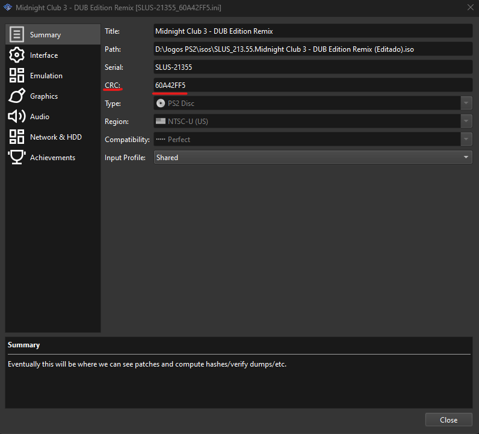
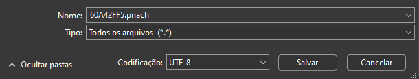

# Arquivos

## Bios

Pacote com várias versões de BIOS, o emulador escolhe a mais adequada ao iniciar o jogo.

Links:

- [BIOS](https://drive.google.com/file/d/1Xf6FORHwr1MPrgkZ8sFWW6nXbhW80OxR/view?usp=sharing)

## Midnight Club 3: Dub Edition Remix

ISO do jogo para download via Torrent.

Links:

- [ISO (Torrent)](https://tinyurl.com/mc3deriso)

## Cheats (Opcional)

Este cheat remove o **Motion Blur** e deixa o jogo em **60 fps**.

1. Descubra qual o CRC da sua ISO. Dentro do `PCSX2`, clique com o botão direito no `Midnight Club 3: Dub Edition Remix` e anote o valor do campo `CRC`.

2. Abra o bloco de notas e cole o seguinte texto:
```
gametitle=Midnight Club 3 - DUB Edition Remix
//60 Fps
patch=1,EE,205280F0,extended,00000000
//Disable Motion Blur
patch=1,EE,201CC3d4,extended,00000000
patch=1,EE,201CC3d8,extended,00000000
patch=1,EE,201CC3e0,extended,00000000
patch=1,EE,201CC3e8,extended,00000000
patch=1,EE,201CC38C,extended,00000000
patch=1,EE,201CC39C,extended,00000000
```
3. Salve o arquivo com o tipo `Todos os arquivos`, o nome deve ser o valor do CRC + a extensão `pnach`. **Ex:** `60A42FF5.pnach`

4. O arquivo deve ficar na pasta `cheats` que está localizada na raiz do `PCSX2`.