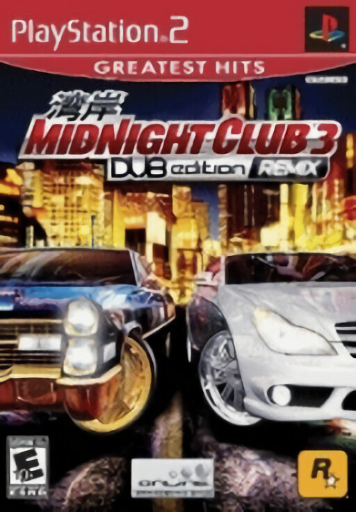

# Início

Com este guia você realizará a instalação e configuração do emulador `PCSX2` para o jogo `Midnight Club 3: Dub Edition Remix`.

 

Siga as seguintes etapas para concluir a configuração:

1. [Ferramentas](/tools/)
2. [Arquivos](/files/)
3. [Configurações](/settings/)
4. [Reshade](/reshade/) (Opcional)
