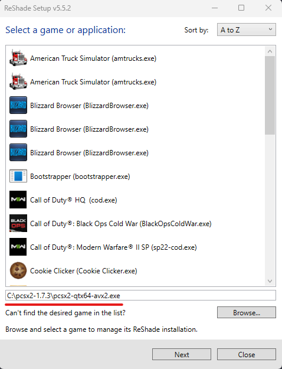
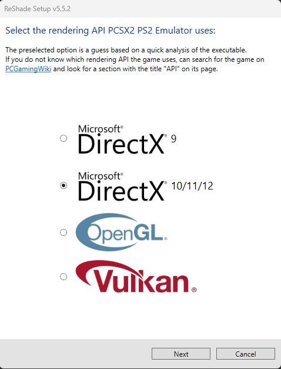
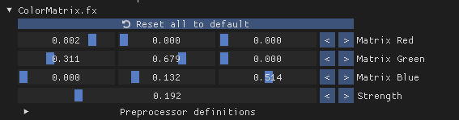
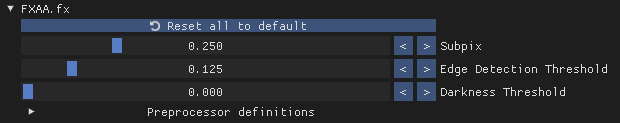
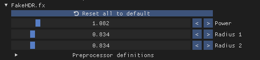
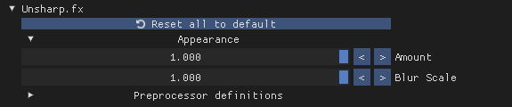
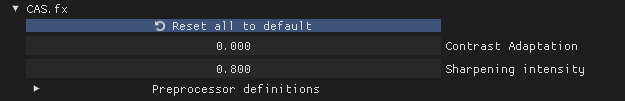
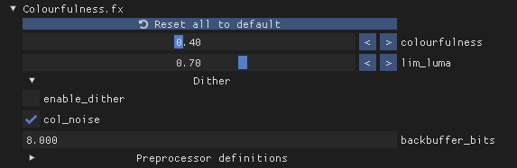

# Reshade

Essa opção é para quem quer deixar o gráfico do jogo ainda mais bonito.

## Download

- Baixe o Reshade: [download](https://reshade.me/#download)

## Instalação

1. Abra o arquivo do Reshade.
2. Clique em `Browse` e selecione o executável do `PCSX2`. Em seguida, clique em `Next`.

3. Escolha a opção `DirectX 10/11/12` e clique em `Next`.

4. Clique novamente em `Next`.
5. Marque as seguintes opções e clique em `Next`.
    - Standard effects
    - SweetFX by CeeJay\.dk
    - qUINT by Marty McFly
    - FXShaders by luluco250
    - Legacy effects
6. Clique em `Finish`.

## Configurações

1. Abra o jogo e aperte a tecla `HOME`. Na primeira execução, aparecerá alguns avisos, só precisa clicar em `Continuar`.
2. Marque as seguintes opções:
    - `ColorMatrix [ColorMatrix.fx]`
    - `FXAA [FXAA.fx]`
    - `HDR [FakeHDR.fx]`
    - `Unsharp [Unsharp.fx]`
    - `AMD FidelityFX Contrast Adaptative Sharpening [CAS.fx]`
    - `Colourfulness [Colourfulness.fx]`

3. Agora partindo para os ajustes finos, na parte inferior deixe os seguintes valores:

    
    
    
    
    
    

4. Só pressionar novamente a tecla `HOME` e aproveitar o jogo.

