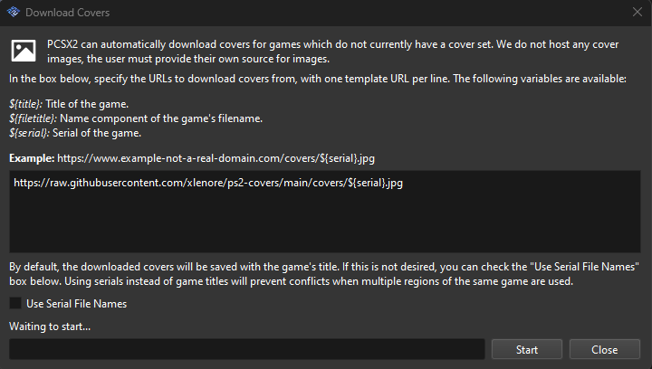

# Configurações

Entre na pasta onde o `PCSX2` foi extraído e abra o executável `pcsx2-qtx64-avx2.exe`.

## Emulação

- Na barra de menus escolha a opção `Settings > Emulation`.

Deixe as configurações da seguinte forma:


## Gráficos

- Com a tela de configurações aberta, mude para `Graphics` e em seguida escolha a aba `Display`.

Deixe as configurações da seguinte forma:


> Em **Renderer**, escolha `Direct3D 12` ou `Direct3D 11`.  
> Em **Adapter** deve aparecer o modelo da sua placa de vídeo.

___

- Na aba `Rendering`, selecione as seguintes configurações:


> Em **Internal Resolution**, escolha a que mais se encaixa no seu setup.  
> O mesmo vale para a opção **Anisotropic Filtering**.

___

- Na aba `Texture Replacement`, selecione as seguintes configurações:


## Bios

- Extraia o arquivo de BIOS baixado na página de [arquivos](/files/#bios), copie todos os arquivos para a pasta `bios`, que se encontra na pasta do `PCSX2`.


## Pasta de jogos

1. Na barra de menus escolha a opção `Settings > Game List`.
2. Clique na opção para adicionar uma pasta.

3. Selecione a pasta onde estão os seus jogos.
4. Clique na opção `Scan For New Games`.

## Download das capas (Opcional)

1. Na barra de menus escolha a opção `Tools > Cover Downloader`.
2. Cole a seguinte URL no campo de texto:
```
https://raw.githubusercontent.com/xlenore/ps2-covers/main/covers/${serial}.jpg
```
3. Marque a caixa `Use Serial File Names`.
4. Clique em `Start`.

